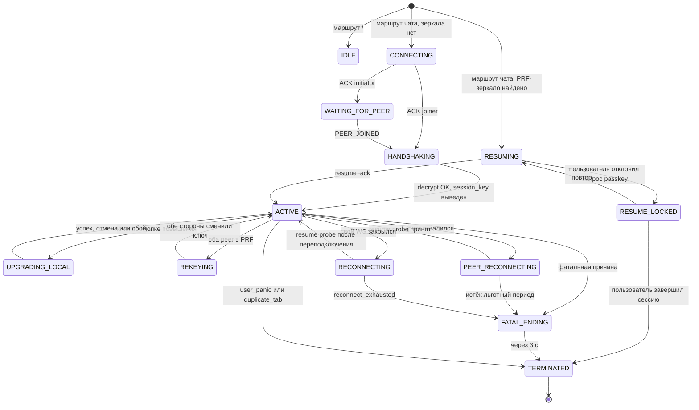

# Unseen — обзор

Unseen — техническая демонстрация возможностей нативной веб-платформы: конфиденциальный 1-на-1 разговор без регистрации, без аккаунтов, без хранения сообщений на сервере. Сервер видит только зашифрованные пакеты и непрозрачный `roomId`.

## Цели

- Сквозное шифрование между двумя браузерами; relay криптоматериала не имеет.
- Взаимная аутентификация по второму каналу через SAS (5 эмодзи с локализованными именами).
- Эфемерность по умолчанию: вкладка закрылась — сессия мертва, постоянных ключей нет.
- Восстановление после F5 или обрыва сети — опционально, по явному согласию пользователя через WebAuthn PRF.
- Передача файлов до 100 MiB с per-chunk AEAD-целостностью.
- Двуязычность (EN и RU) из коробки.

## Не-цели

- Не Signal: одноразовые сессии, а не повседневный мессенджер.
- Не PWA, не Service Worker, не offline-first, не нативные приложения, не push.
- Не групповые чаты, не голос и видео, не федерация, не восстановление аккаунта.
- Не пост-квантовая криптография: в Web Crypto её нет.
- Не правдоподобное отрицание: подтверждённый SAS привязывает session key к двум устройствам.
- Не максимальная защита: 40-битный SAS уязвим к целенаправленному офлайн-перебору, маскирующего трафика и выравнивания длины нет.

## Платформа

Только современные браузеры: **Chrome 153+, Firefox 155+, Safari 26.6+**. Никаких полифилов, транспиляции и сборок под устаревшие браузеры; `Bun.build` с `target: "browser"` выдаёт чистый ESM. Полный перечень используемых возможностей и их поддержки — `BASELINE.md`.

| Возможность                                                         | Статус                                                                           |
| ------------------------------------------------------------------- | -------------------------------------------------------------------------------- |
| `navigator.locks` (Web Locks)                                       | **обязательна**: защита от повторной вкладки, дубль — блокирующее предупреждение |
| `navigator.storage.getDirectory` (OPFS)                             | обязательна для передачи файлов; при отсутствии UI файлов отключается            |
| `PublicKeyCredential.isUserVerifyingPlatformAuthenticatorAvailable` | проба для opt-in PRF; при отсутствии кнопка повышения защиты скрыта              |
| `Temporal`                                                          | недоступна: ни один выпуск Safari её не отдаёт, время через `Date.toISOString()` |

Единственная зависимость клиента в рабочей сборке — `lit`. `@noble/hashes` даёт потоковый SHA-256 для файловых чанков, которого нет в `subtle.digest`.

## Модель угроз

### Защищаемся от

| Угроза                                             | Защита                                                                                                                                                                              |
| -------------------------------------------------- | ----------------------------------------------------------------------------------------------------------------------------------------------------------------------------------- |
| Пассивный наблюдатель сети                         | TLS и E2E AEAD: содержимое и идентификаторы скрыты                                                                                                                                  |
| Компрометация relay после честной загрузки клиента | Сервер не имеет ключей и видит только блобы; отбрасывание, подмена и перестановка пакетов сводятся к DoS                                                                            |
| Утечка ссылки (скриншот, история, пересылка)       | SAS-сверка по второму каналу и жёсткий лимит в 2 клиента на комнату                                                                                                                 |
| MITM на сервере                                    | `handshake_key` выводится из URL fragment, который на сервер не уходит                                                                                                              |
| Подключение третьего                               | Сервер отвергает третьего клиента с `ROOM_FULL`                                                                                                                                     |
| Replay                                             | Монотонный счётчик в nonce, приём строго `counterRecv + 1`, повтор или разрыв завершают сессию                                                                                      |
| Метаданные в логах                                 | Логгер с двойным allowlist: IP, `roomId`, размеры, тайминги и содержимое не пишутся                                                                                                 |
| CSWSH                                              | Origin проверяется на WS-upgrade против allowlist до резервирования слота                                                                                                           |
| Эксфильтрация `session_key` через XSS              | RAM: ключ только в JS heap, хранилище пусто. PRF soft: обёрнут AES-KW ключом из WebAuthn PRF (нужен жест user verification). Hardened: ключ non-extractable, `exportKey` невозможен |
| Злоупотребления peer                               | Ограничение темпа рендера и лимит DOM в 500 сообщений, allowlist схем URL с видимым host, вырезание bidi-управляющих, NFC и лимит combining marks                                   |
| Type confusion между msg и chunk                   | Kind-byte привязан к AAD, подделка kind ломает GCM tag                                                                                                                              |

### Не защищаемся от

| Угроза                                      | Почему                                                                                                                                                                                                     |
| ------------------------------------------- | ---------------------------------------------------------------------------------------------------------------------------------------------------------------------------------------------------------- |
| Скомпрометированный собственный бандл       | Если origin отдаёт вредоносный JS, защиты нет, и CSP не помогает. За целостность бандла отвечает тот, кто разворачивает инстанс; SRI закрывает только подмену ресурсов при честно загруженной HTML-обёртке |
| Вредоносное ПО на устройстве                | Вне области защиты                                                                                                                                                                                         |
| Физическое принуждение                      | Протокола правдоподобного отрицания нет                                                                                                                                                                    |
| Корреляция трафика                          | Unseen не Tor: скрытие факта обращения — задача анонимизирующего слоя                                                                                                                                      |
| Cold boot и RAM-форензика                   | Браузер держит `session_key` в JS heap, пока вкладка жива                                                                                                                                                  |
| Логи хостинга, reverse proxy, CDN           | Серверный логгер не пишет, но nginx, Caddy и CDN по умолчанию пишут: отключить access_log обязан тот, кто разворачивает инстанс                                                                            |
| Browser sync                                | URL с fragment может синхронизироваться; для критичных случаев нужен приватный режим                                                                                                                       |
| Метаданные каждого сообщения                | Nonce открыт в RELAY, AES-GCM не требует его секретности; сервер видит размеры и тайминги                                                                                                                  |
| F5 и обрыв сети в RAM-режиме                | Без PRF-повышения любой WS close завершает сессию; компромисс обозначен кнопкой повышения                                                                                                                  |
| Post-compromise security                    | Double-ratchet нет: компрометация `session_key` раскрывает всю сессию, модель одноразового разговора                                                                                                       |
| Image-decoder CVE браузера                  | Передача файлов download-only: приложение не декодирует контролируемые атакующим байты и не рендерит вложения inline                                                                                       |
| OPFS-остаток plaintext во время передачи    | Чанки читаемы для same-origin JS и DevTools, пока передача активна; TERMINATED, BFCache restore и panic-wipe сразу зачищают пространство имён                                                              |
| Сигнатура трафика при передаче файла        | Всплеск чанков отличается от чат-трафика, выравнивания длины и маскирующего трафика нет                                                                                                                    |
| Реализация Web Crypto и WebAuthn в браузере | Доверяем браузеру                                                                                                                                                                                          |
| Скриншот, clipboard, захват экрана          | Plaintext в DOM, пока вкладка открыта; `user-select` разрешён                                                                                                                                              |

## Архитектура

```
┌──────────────┐         ┌──────────────────┐         ┌──────────────┐
│   Client A   │◀──wss──▶│    Bun.serve     │◀──wss──▶│   Client B   │
│   (browser)  │         │   relay server   │         │   (browser)  │
└──────────────┘         └──────────────────┘         └──────────────┘
  secret, handshake_key,   roomId,                      secret, handshake_key,
  session_key,             непрозрачные блобы,          session_key,
  peer eph_pub, SAS        счётчики, тайминги           peer eph_pub, SAS
```

Два браузера открывают одну ссылку с 256-битным секретом в URL fragment. Из секрета через HKDF выводятся `roomId` для сервера и семейство секретных значений: ключ handshake, SAS-anchor, непрозрачные имена хранилища и OPFS-директории, PRF salt. Клиенты подключаются по WebSocket, сервер сводит их в комнату с тем же `roomId` (максимум два слота). Через зашифрованный handshake они обмениваются эфемерными открытыми ключами X25519 и выводят `session_key`, из него — SAS для сверки по второму каналу. Каждое сообщение шифруется AES-256-GCM с монотонным счётчиком и пересылается через сервер как непрозрачный блоб.

Все сессии стартуют в **RAM-режиме**: `session_key` живёт только в heap, в хранилище ничего не пишется, любой WS close завершает сессию. Пользователь может явно поднять защиту до **PRF-режима**: регистрируется WebAuthn passkey для комнаты, ключ оборачивается AES-KW и пишется в `sessionStorage`, сессия переживает F5 и обрыв сети. Когда оба peer в PRF, происходит согласованный rekey через свежий X25519 ECDH внутри зашифрованного канала: новый `session_key` non-extractable, исходный extractable забывается.

Внутреннее устройство сторон — `03-client.md` и `04-server.md`.

## Границы доверия

| Знание                                      | Alice | Server                    | Bob  |
| ------------------------------------------- | ----- | ------------------------- | ---- |
| `secret` (URL fragment)                     | ✅    | ❌                        | ✅   |
| `roomId`                                    | ✅    | ✅                        | ✅   |
| `handshake_key`, `sas_anchor`, `prfSalt`    | ✅    | ❌                        | ✅   |
| Эфемерные закрытые ключи X25519             | свой  | ❌                        | свой |
| `session_key`, SAS                          | ✅    | ❌                        | ✅   |
| Plaintext и файловые чанки                  | ✅    | ❌                        | ✅   |
| `type`, `kind`, `nonce`, `ct_len` (открыты) | ✅    | ✅                        | ✅   |
| IP, размеры пакетов, тайминги               | свой  | runtime-only, не логирует | свой |

Сервер видит сетевой уровень и открытые служебные байты wire-протокола. Ни одного клиентского ключа и ни одного байта plaintext он не видит.

## Машина состояний сессии

Тринадцать состояний клиентского FSM. Переходы reconnect, resume и rekey доступны только в PRF-режиме.



Переходы восстановления и rekey детализированы в `02-protocol.md`.

## Что переживает перезагрузку вкладки

| Событие          | RAM-режим                            | PRF-режим                                                    |
| ---------------- | ------------------------------------ | ------------------------------------------------------------ |
| F5               | `session_key` потерян, сессия мертва | восстанавливается через WebAuthn PRF и AES-KW unwrap         |
| Обрыв своего WS  | TERMINATED сразу                     | RECONNECTING с backoff до 5 минут                            |
| Обрыв peer       | TERMINATED сразу                     | PEER_RECONNECTING с отсчётом до серверного льготного периода |
| Закрытие вкладки | TERMINATED                           | TERMINATED, зеркало в `sessionStorage` умирает с вкладкой    |
| Burn             | мгновенный TERMINATED                | мгновенный TERMINATED и сигнал удаления per-room passkey     |

## Карта спецификации

- `02-protocol.md` — примитивы, wire-формат, handshake, SAS, счётчики, resume, rekey, коды ошибок, схема хранилища.
- `03-client.md` — маршрутизация, компоненты, состояние, lifecycle, WebAuthn, Markdown, передача файлов, сборка.
- `04-server.md` — конфигурация, HTTP и статика, WebSocket, комнаты, лимиты темпа, логи, метрики.
